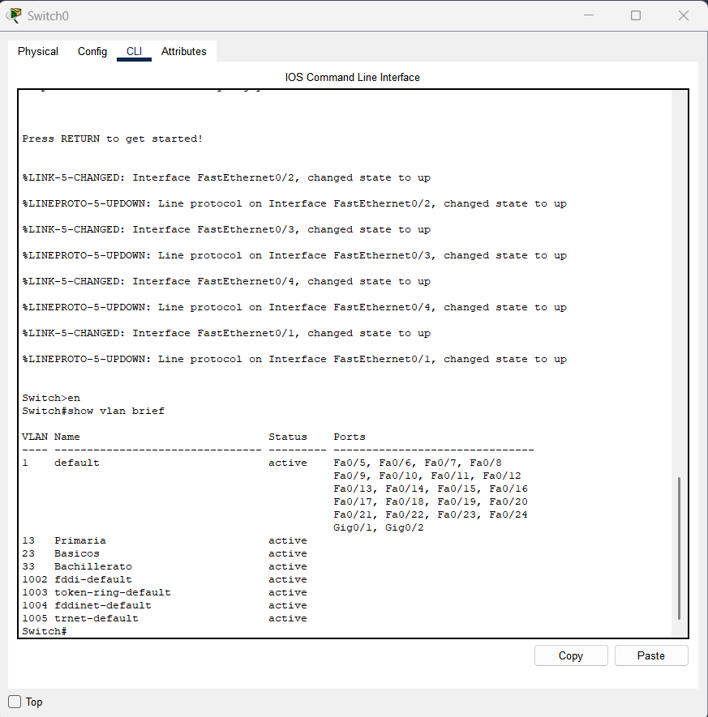
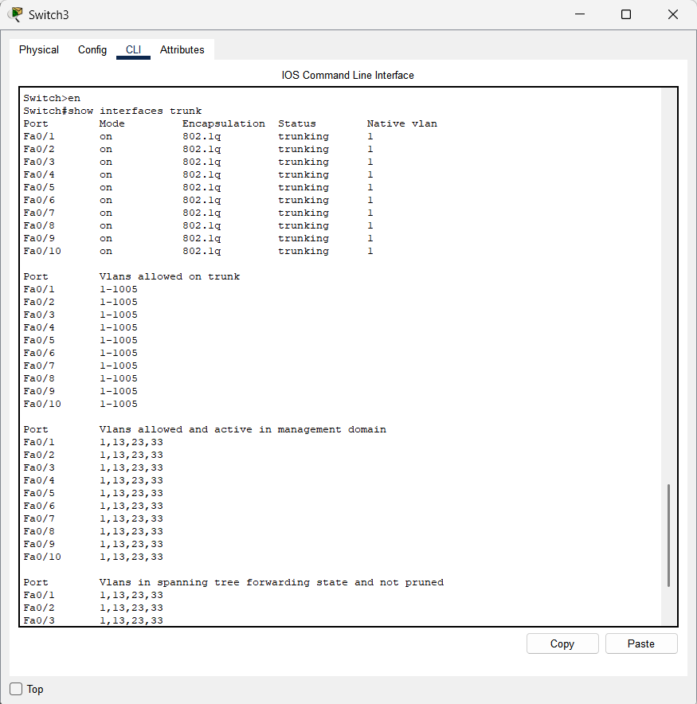
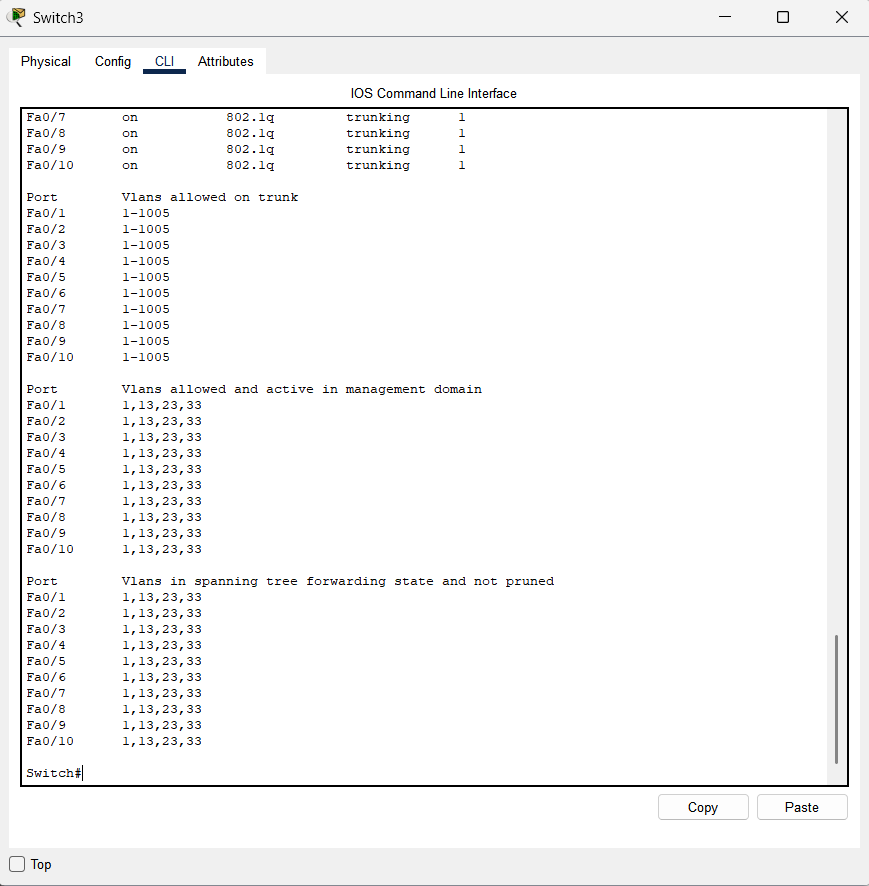
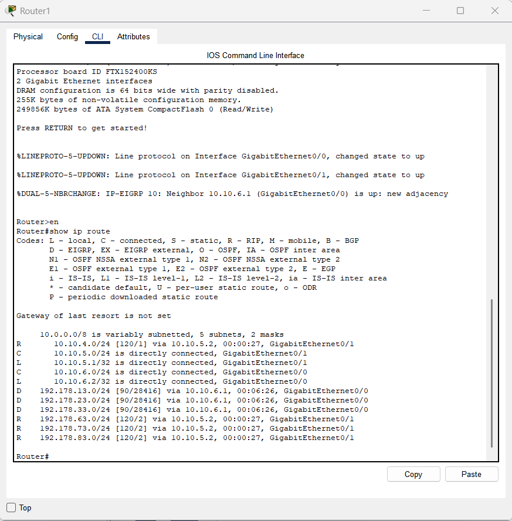
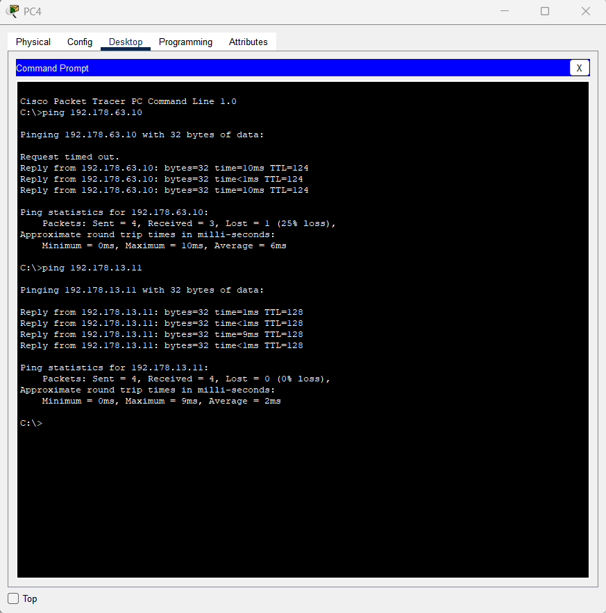

# Manual Técnico: Infraestructura de Red Interconectada (Edificios USAC)

## 1. Descripción General

El proyecto consiste en la implementación de una red empresarial segmentada por VLANs, que interconecta tres edificios principales utilizando una combinación de protocolos de enrutamiento dinámico (**EIGRP, RIPv2 y OSPF**) y redundancia de Capa 2 mediante **STP**.

---

## 2. Segmentación de Red (VLANs)

Se implementaron VLANs para separar el tráfico administrativo y académico, garantizando seguridad y eficiencia en el dominio de broadcast.

| Edificio | VLAN | Nombre | Red IP | Gateway |
| --- | --- | --- | --- | --- |
| **Izquierdo** | 13 | Primaria | 192.178.13.0/24 | 192.178.13.1 |
| **Izquierdo** | 23 | Básicos | 192.178.23.0/24 | 192.178.23.1 |
| **Izquierdo** | 33 | Bachillerato | 192.178.33.0/24 | 192.178.33.1 |
| **Derecho** | 63 | Primaria | 192.178.63.0/24 | 192.178.63.1 |
| **Derecho** | 73 | Básicos | 192.178.73.0/24 | 192.178.73.1 |
| **Derecho** | 83 | Bachillerato | 192.178.83.0/24 | 192.178.83.1 |



---

## 3. Configuración de Capa 2

### Spanning Tree Protocol (STP)

Para evitar bucles en la topología de malla ("telaraña"), se utilizó **PVST+**. Se verificó que cada VLAN posea un camino libre de loops.

* **Comando de verificación:** `show spanning-tree`.
* **Detalle:** Se identificaron puertos en estado `Root` y `Designated` asegurando convergencia total.

### Seguridad de Puertos (Port-Security)

En la VLAN de **Básicos**, se restringió el acceso físico.

* **Configuración:** Máximo 1 dirección MAC por puerto, modo `sticky` y acción `shutdown` ante violaciones.





---

## 4. Enrutamiento y Redistribución

El núcleo de la red utiliza una arquitectura de **redistribución mutua** en el Router1 y Router4 para permitir la visibilidad entre protocolos heterogéneos.

### Comandos Principales de Configuración:

* **EIGRP:** `router eigrp 100`, `network 192.178.0.0`.
* **OSPF:** `router ospf 1`, `network 10.10.4.0 0.0.0.3 area 0`.
* **Redistribución (en Router1):**
```text
router rip
 redistribute eigrp 100 metric 5
router eigrp 100
 redistribute rip metric 1000 100 255 1 1500

```




---

## 5. Pruebas de Conectividad (Pruebas de Campo)

Se realizaron pruebas de ICMP satisfactorias entre los puntos más distantes de la red.

1. **PC4 (Primaria Izq) -> PC5 (Primaria Izq):** Éxito (Comunicación Intra-VLAN).
2. **PC4 (Primaria Izq) -> Router0 (Gateway):** Éxito (Inter-VLAN Routing).
3. **PC4 (Primaria Izq) -> PC de Primaria Derecha:** Éxito (Redistribución de protocolos).



---

## 6. Conclusiones Técnicas

* La implementación de **Trunking (802.1Q)** en todos los switches intermedios fue vital para el transporte de etiquetas VLAN a través de la red.
* La **redistribución de rutas** permitió que el edificio con OSPF se comunicara con el edificio EIGRP, utilizando RIPv2 como protocolo de tránsito.

