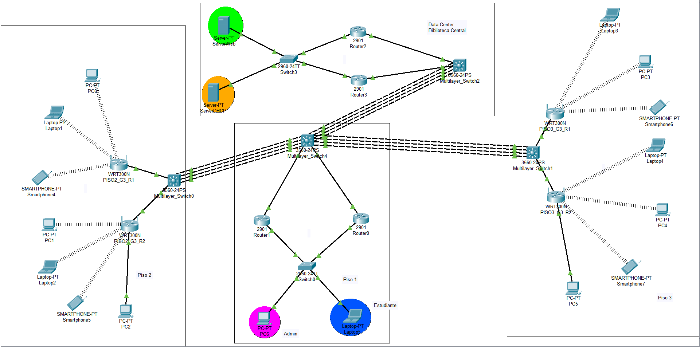

# Manual Técnico - Práctica 2: Modernización de Red USAC
**Facultad de Ingeniería - Universidad de San Carlos de Guatemala**  
**Grupo No. 21**

A continuación se detalla la configuración técnica implementada para la modernización de la red del edificio de la biblioteca, cumpliendo con los lineamientos de alta disponibilidad, seguridad y escalabilidad.

---

## 1. Topología Propuesta

La red se diseñó utilizando un modelo jerárquico que integra conectividad cableada tradicional e inalámbrica, centralizando los servicios en la Biblioteca Central.

*   **Piso 1:** Infraestructura cableada tradicional dividida en áreas de Administración (VLAN 13) y Estudiantes (VLAN 23). Cuenta con redundancia de puerta de enlace mediante dos routers configurados con **HSRP**.
*   **Pisos 2 y 3:** Zonas de acceso inalámbrico (WiFi) implementadas mediante routers WRT300N configurados como Access Points, gestionados por switches multicapa que realizan el ruteo inter-VLAN.
*   **Biblioteca Central:** Ubicación del Data Center que aloja los servidores DNS, HTTP y DHCP. El acceso a estos servidores está protegido por redundancia **HSRP** en los routers perimetrales.
*   **Interconexión (Core):** Un switch multicapa central (3560) une todos los edificios utilizando 4 enlaces agregados mediante **LACP** (EtherChannel) para asegurar un mayor ancho de banda y tolerancia a fallos. El protocolo de enrutamiento utilizado en toda la topología es **EIGRP** (AS 1).



---

## 2. Desglose de Subnetting (VLSM y FLSM)

Se utilizó la red general `192.198.X.0/24` (donde **X=3** por ser el Grupo 3) para las redes LAN y la red `10.2.3.0/24` para el enrutamiento.

### 2.1. Subnetting VLSM (Piso 1)
La red `192.198.13.0/24` se dividió utilizando VLSM para ajustar el tamaño de las subredes a la cantidad exacta de hosts requeridos.

| Segmento / VLAN | Hosts Requeridos | Dirección de Red | Primera IP Útil (Gateway Virtual) | Última IP Útil | Broadcast | Máscara |
| :--- | :--- | :--- | :--- | :--- | :--- | :--- |
| **ADMIN (VLAN 13)** | 10 | 192.198.13.0/28 | 192.198.13.1 | 192.198.13.14 | 192.198.13.15 | 255.255.255.240 |
| **ESTUDIANTES (VLAN 23)** | 60 | 192.198.13.64/26 | 192.198.13.65 | 192.198.13.126 | 192.198.13.127 | 255.255.255.192 |

### 2.2. Subnetting FLSM (Pisos 2, 3 y Biblioteca Central)
Las redes inalámbricas y de servidores se dividieron en partes iguales (FLSM) utilizando máscaras `/25` (128 IPs por subred).

| Ubicación | Segmento / VLAN | Dirección de Red | Gateway | Máscara |
| :--- | :--- | :--- | :--- | :--- |
| **Piso 2** | WLAN1 (VLAN 231) | 192.198.23.0/25 | 192.198.23.1 | 255.255.255.128 |
| **Piso 2** | WLAN2 (VLAN 232) | 192.198.23.128/25 | 192.198.23.129 | 255.255.255.128 |
| **Piso 3** | WLAN1 (VLAN 331) | 192.198.33.0/25 | 192.198.33.1 | 255.255.255.128 |
| **Piso 3** | WLAN2 (VLAN 332) | 192.198.33.128/25 | 192.198.33.129 | 255.255.255.128 |
| **Biblioteca Central** | WEB_SERVERS (VLAN 33) | 192.198.100.0/25 | 192.198.100.1 (Virtual) | 255.255.255.128 |
| **Biblioteca Central** | DHCP_SERVERS (VLAN 43) | 192.198.100.128/25 | 192.198.100.129 (Virtual)| 255.255.255.128 |

### 2.3. Red de Enrutamiento (Enlaces Punto a Punto)
La red `10.2.3.0/24` se dividió en bloques `/30` (Máscara 255.255.255.252) para los enlaces WAN entre los routers físicos y los switches multicapa.
*   **Ejemplos de subredes:** `10.2.3.0/30`, `10.2.3.4/30`, `10.2.3.8/30`, etc.

---

## 3. Configuraciones DHCP

### 3.1. Servidor Central DHCP (VLAN 43)
El servidor DHCP centralizado (IP `192.198.100.140`) administra las direcciones para todos los dispositivos finales de la red. 

**Pools configurados:**
*   **ADMIN_VL13:** Gateway `192.198.13.1`, DNS `192.198.100.10`, Subnet `255.255.255.240`, Inicio: `192.198.13.5`
*   **ESTUDIANTES_VL23:** Gateway `192.198.13.65`, DNS `192.198.100.10`, Subnet `255.255.255.192`, Inicio: `192.198.13.70`
*   **WLAN1_PISO2:** Gateway `192.198.23.1`, DNS `192.198.100.10`, Subnet `255.255.255.128`
*   **WLAN2_PISO2:** Gateway `192.198.23.129`, DNS `192.198.100.10`, Subnet `255.255.255.128`
*   **WLAN1_PISO3:** Gateway `192.198.33.1`, DNS `192.198.100.10`, Subnet `255.255.255.128`
*   **WLAN2_PISO3:** Gateway `192.198.33.129`, DNS `192.198.100.10`, Subnet `255.255.255.128`

> **[ESPACIO PARA IMAGEN: dhcp.png]**

Para que las peticiones DHCP crucen las diferentes subredes, se configuró el comando `ip helper-address 192.198.100.140` en todas las interfaces de los Gateways correspondientes.

### 3.2. Routers Inalámbricos (WRT300N)
Para garantizar que los dispositivos inalámbricos reciban IPs del Servidor DHCP Central, los routers inalámbricos se configuraron como puentes (Access Points):
*   **Conexión Física:** El cable proveniente del Switch Multicapa se conectó a uno de los puertos **Ethernet** (LAN), dejando libre el puerto "Internet".
*   **Servidor DHCP Interno:** Se configuró en estado **Disabled** en la pestaña *Basic Setup* para evitar asignación de IPs locales (como la 192.168.0.x).
*   **SSID (Piso 2):** PISO2_G3_R1 y PISO2_G3_R2 (Broadcast Oculto).
*   **SSID (Piso 3):** PISO3_G3_R1 y PISO3_G3_R2 (Broadcast Visible).
*   **Seguridad:** WPA2 Personal.

---

## 4. Configuración DNS y HTTP de Servidor WEB

El servidor Web y DNS se ubica en la VLAN 33 con la IP estática `192.198.100.10` y Gateway `192.198.100.1`.

### 4.1. Configuración DNS
Se habilitó el servicio DNS para traducir el nombre de dominio a la IP del servidor.
*   **Service:** ON
*   **Name:** `www.practica2_Grupo3.com`
*   **Type:** A Record
*   **Address:** `192.198.100.10`

### 4.2. Configuración HTTP
Se habilitó el servicio HTTP/HTTPS y se editó el archivo `index.html` para desplegar una página estática que muestra los datos de los integrantes del Grupo 3 al acceder desde cualquier navegador web en la red.

---

## 5. Comandos Utilizados

A continuación, se presentan los bloques de comandos principales aplicados en la infraestructura:

### Enrutamiento Dinámico (EIGRP AS 1)
Implementado en routers y switches multicapa.
```bash
router eigrp 1
 network 10.2.3.0 0.0.0.3
 network 192.198.13.0 0.0.0.15
 network 192.198.13.64 0.0.0.63
 no auto-summary
```

### Alta Disponibilidad (HSRP)
Implementado en los routers del Piso 1 y Biblioteca Central para crear un Gateway Virtual.
```bash
interface GigabitEthernet0/1.13
 encapsulation dot1Q 13
 ip address 192.198.13.2 255.255.255.240
 standby 13 ip 192.198.13.1
 standby 13 priority 110
 standby 13 preempt
```

### Agregación de Enlaces (LACP)
Configuración de EtherChannel entre switches.
```bash
interface range FastEthernet0/1-4
 channel-group 1 mode active
```
```bash
interface Port-channel1
 switchport mode trunk
```

### Agente de Relevo DHCP (IP Helper)
Aplicado en las subinterfaces y SVIs que actúan como Gateways.
```bash
interface Vlan231
 ip address 192.198.23.1 255.255.255.128
 ip helper-address 192.198.100.140
```

### Configuración de VLANs y Puertos Ruteados
```bash
! Creación de VLAN
vlan 33
 name WEB_SERVERS

! Puerto en Modo Acceso
interface FastEthernet0/1
 switchport mode access
 switchport access vlan 33
 spanning-tree portfast

! Puerto Ruteado (Capa 3) en Switch Multicapa
interface FastEthernet0/14
 no switchport
 ip address 10.2.3.2 255.255.255.252
```
